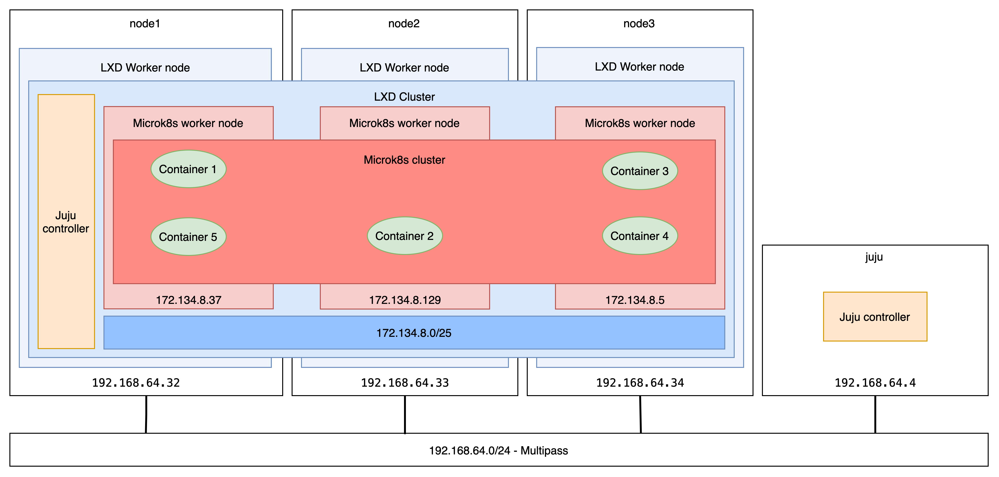

# Arm, Ubuntu, K8s: Build Your Own Cloud for Edge Computing

<!-- 

LXD requires to build with charmcraft (complex and useless)
TODO: update with final LXD charm once ready, or distribute private precompiled charms

TODO: more drawings and more on the outcome

TODO: LXD from charmhub command to be checked

-->

**Have you dreamt of having your own home cloud but found it too complex?     
Micro clouds enable anyone to build a lightweight cloud anywhere.**

## Abstract

Building micro clouds or edge clouds has vast potential.
The edge is where the real world happens.
Edge clusters bring your technologies to the consumer for more privacy and less latency.
So, where to begin? With Arm, obviously. But what about after that?

This workshop gets you started.
It's suitable for beginners, from install, set-up and config of an Ubuntu K8s cluster.
But it also has value for experts, talking DevOps, AI use cases, and inferences at the edge, on something as simple and accessible as a Raspberry Pi or a Jetson Nano.

<p align="center">

</p>

<!-- TODO: update table of contents -->
Table of Contents
=================

   * [Abstract](#abstract)
   * [Minimum Configuration](#minimum-configuration)
   * [Building Your Home Lab Micro Cloud in 5 Steps](#building-your-home-lab-micro-cloud-in-5-steps)
      * [Checkpoint 0](#checkpoint-0)
      * [#1 Prepare the bare metal nodes](./step-01-prepare-bare-nodes.md#1-prepare-the-bare-metal-nodes)
         * [Option A: Multipass VMs](./step-01-prepare-bare-nodes.md#option-a-multipass-virtual-machines)
         * [Option B: Cloud VMs](./step-01-prepare-bare-nodes.md#option-b-ec2-aws-virtual-machines)
         * [Option π: Raspberry Pi](./step-01-prepare-bare-nodes.md#option-π-raspberry-pi-cluster)
      * [#2 Register for model-driven operations](./step-02-model-driven-operations.md#2-register-for-model-driven-operations)
         * [What are Model-Driven Operations?](./step-02-model-driven-operations.md#what-are-model-driven-operations)
         * [Register the bare nodes with Juju](./step-02-model-driven-operations.md#register-the-bare-nodes-with-juju)
      * [#3 Cluster the machines with LXD: your first cloud!](./step-03-lxd-cloud.md#3-cluster-the-machines-with-lxd-your-first-cloud)
         * [Option A: Build your private LXD cloud in one command with Juju](./step-03-lxd-cloud.md#option-a-build-your-private-lxd-cloud-in-one-juju-command)>
         * [Option B: Manually deploy LXD cluster](./step-03-lxd-cloud.md#option-b-manually-configure-lxd-cluster)
      * [#4 Create on-demand MicroK8s clusters](./step-04-microk8s-cluster.md#4-create-on-demand-microk8s-clusters)
         * [Option A: Deploy on-demand kubernetes clusters in one Juju command](./step-04-microk8s-cluster.md#option-a-deploy-on-demand-kubernetes-clusters-in-one-juju-command)
         * [Option B: Manually deploy MicroK8s clusters](./step-04-microk8s-cluster.md#option-b-manually-deploy-microk8s-clusters)
      * [#5 Run cloud-native applications at the edge with micro clouds](./step-05-micro-cloud-native.md#5-run-cloud-native-applications-at-the-edge-with-micro-clouds)
         * [Register your MicroK8s edge clusters with Portainer](./step-05-micro-cloud-native.md#register-your-microk8s-edge-clusters-with-portainer)
         <!-- * [Register your MicroK8s edge clusters with Juju](./step-05-micro-cloud-native.md#register-your-microk8s-edge-clusters-with-juju)
         * [Deploy applications to your micro cloud with Juju and Charms](./step-05-micro-cloud-native.md#deploy-applications-to-your-micro-cloud-with-juju-and-charms) -->
   * [Cleaning behind: how to remove leftovers from your machine](./step-05-micro-cloud-native.md#how-to-clean-your-machine)
   * [Authors/Reviewers](./step-05-micro-cloud-native.md#authorsreviewers)

<p align="center">

</p>

## Minimum Configuration

> To enable more people to follow this tutorial at home, we won't require any specific hardware - only your workstation.
> Nonetheless, you will find secondary paths and alternative options all along, including instructions to use a cluster of Raspberry Pis.
> The following requirements apply if you're willing to follow the primary path, using virtualisation to emulate multiple small devices:

- 16GB RAM recommended (8GB min required).
- Min 4-core CPU.
- Min 50GB of disk storage left.
- [Multipass installed](https://multipass.run/) for your platform (stick to the default configuration).

<details>
    <summary>
Before attending the session, please make sure you can use Multipass. The following commands should run without any specific configuration (click to expand).
    </summary>

```sh
    $ multipass launch --name iamatest --mem 16G --disk 10GB --cpus 4
    Launched: iamatest 

    $ multipass list
    Name                    State             IPv4             Image
    iamatest                Running           192.168.64.71    Ubuntu 20.04 LTS

    $ multipass exec iamatest -- sudo snap install microk8s --classic
    microk8s (1.21/stable) v1.21.3 from Canonical✓ installed

    $ multipass exec iamatest -- sudo microk8s status --wait-ready
    microk8s is running
    high-availability: no
    datastore master nodes: 127.0.0.1:19001
    datastore standby nodes: none
    ...

    $ multipass stop iamatest
    $ multipass delete iamatest
    $ multipass list
    Name                    State             IPv4             Image
    iamatest                Deleted           --               Not Available

    $ multipass purge
```

> The sequence above should not take more than 10mn to run.
> Otherwise, please consider stopping any greedy processes, using a more powerful machine or trying a cloud-based virtual machine.

</details>
</br>

### Issues with VPN software

It has been reported that VPNs (OpenVPN, AnyConnect...) might cause DNS issues.
**If you have the option to disable your VPN, please do.**
Otherwise, you can try [this workaround](https://github.com/canonical/multipass/issues/495#issuecomment-448461250).

**If you can't get it to work on your machine, please consider going for cloud virtual machines.**    
To set it up before the workshop, refer to [the next step's instructions](./step-01-prepare-bare-nodes.md#option-b-ec2-aws-virtual-machines).
<!-- TODO: also add the DNS workaround -->
<!--

$ multipass shell node1 [Or whatever node needs to be configured]
ubuntu@node1:~$ sudo mkdir /etc/systemd/resolve.conf.d
ubuntu@node1:~$ sudo touch /etc/systemd/resolve.conf.d/dns_servers.conf
ubuntu@node1:~$ sudo nano /etc/systemd/resolve.conf.d/dns_servers.conf
 
And in the file add:

[Resolve]
DNS=1.1.1.1
Domains=~.

-->


## Building Your Home Lab Micro Cloud in 5 Steps

_Expected overall tutorial duration: 70 minutes_

Once the tutorial is complete, you'll get the following picture running on your edge/home lab.



<!-- ### 1,2,3... 4 nodes -->
<!-- ToDo: section about 3 or 4 nodes? 3 for HA, >4 for resilient HA. 3 to limit power usage. -->

---

### Checkpoint 0

To make it easier to follow, we split this tutorial into five steps with clear goals.
At the end of each step, a checkpoint will help you understand the intended outcome.
If you can't get to the checkpoint, please reach out for help to the staff or [online forums](https://discourse.ubuntu.com/). You are also welcome to [open issues](https://github.com/valentincanonical/diy-microcloud/issues) directly on this repository.

> **Checkpoint #0: [Minimum requirements matched.](#minimum-configuration)**    

---

[Next step (1/5): Prepare the bare metal nodes >](./step-01-prepare-bare-nodes.md#1-prepare-the-bare-metal-nodes)
