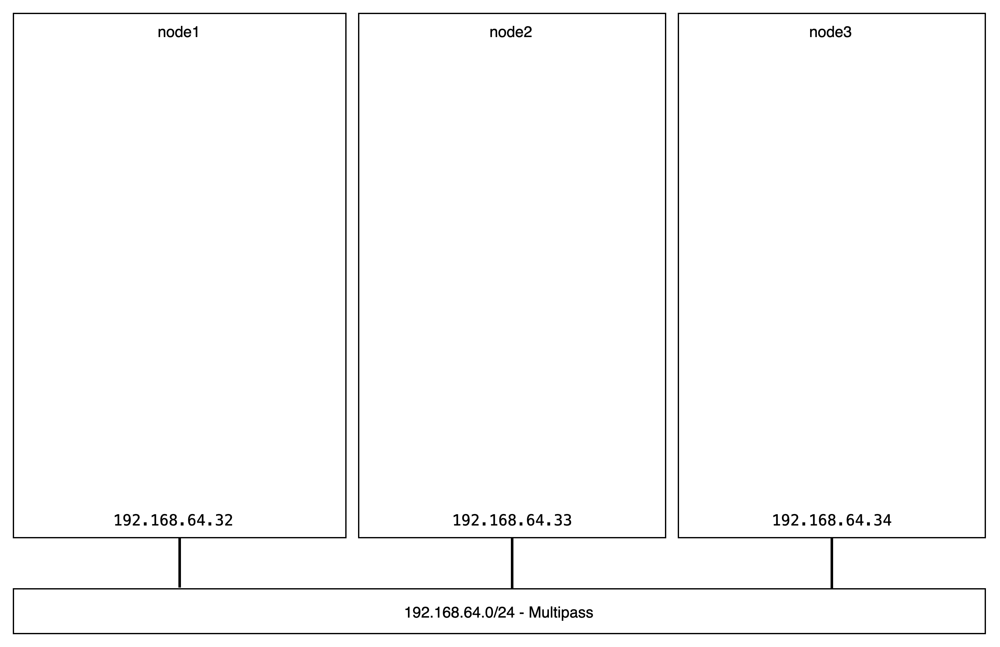

[< back to the introduction](./README.md#building-your-home-lab-micro-cloud-in-5-steps)

# #1 Prepare the bare metal nodes

_Expected duration: 10mn_

> In a typical micro cloud setup, this step (bare metal provisioning) would be fully automated. [Metal as a Service (MAAS)](https://maas.io/) can provision anywhere from a handful to hundreds of physical servers and micro clouds spread over various locations. MAAS provides a way to flexibly deploy, manage, and maintain operating system loads on physical servers. It keeps track of all servers and their configurations available in the micro cloud. It is the base layer of the micro cloud stack.

> In this virtual and one-site configuration, we won't be using MAAS. As micro clouds are fully modular, this will allow us to focus on the virtualisation and K8s layers. We invite you to [read more about MAAS](https://maas.io/tutorials) to automate your bare metal provisioning in further micro cloud deployments!     
> There's even [a great tutorial](https://maas.io/tutorials/build-a-maas-and-lxd-environment-in-30-minutes-with-multipass-on-ubuntu#1-overview) to get you started in 30mn with MAAS in Multipass.

This tutorial's instructions use Multipass VMs (Option A), but if you're feeling confortable, you can go with either Cloud VMs (Option B, recommended for smaller configurations) or Rapsberry Pis (Option π, recommended for nerdy users who want to get a working homelab out of this workshop).

## Option A: Multipass virtual machines

This first step guides you through the provisioning of three Ubuntu machines using Multipass. The three virtual machines will emulate three physical nodes - let them be Raspberry Pis or any other small edge hardware. For a more resilient configuration, you might want to consider adding a fourth more node... it's as simple as repeating everything one more time!
<!-- ToDo: backlink to 1,2,3,4 section -->

```sh
#!/bin/bash

# Let's use bash to loop over the creation of four Ubuntu machines using Multipass
$ for i in {1..3}; do multipass launch --name node$i --mem 8G --disk 10G --cpus 4; done;
Launched: node1
Launched: node2
Launched: node3

$ multipass list
Name                    State             IPv4             Image
node1                   Running           192.168.64.32    Ubuntu 20.04 LTS
node2                   Running           192.168.64.33    Ubuntu 20.04 LTS
node3                   Running           192.168.64.34    Ubuntu 20.04 LTS

$ multipass shell node1
ubuntu@node1:~$ # That's it! We now have three Ubuntu machines ready-to-go
ubuntu@node1:~$ logout
```


## Option B: EC2 (AWS) virtual machines

If your machine is too small or already busy, or the network is too slow or you don't have the right permissions to install/run Multipass, using cloud virtual machines is a convenient backup option for this workshop.

This section documents how to use AWS EC2 instances instead of Multipass VMs. Please note that free-tier configurations won't be powerful enough to go through the end of the tutorial (running MicroK8s clusters). **You'll need to launch charged instances.**     

**At the time of writing, going through this tutorial with EC2 t2.large instances won't cost more than $2.**

[Click here for instructions on how to configure the Amazon EC2 instances for this tutorial.](./step01-ec2-vms/README.md#using-ec2-instances-on-aws)

Once you've completed the instructions linked above, following the tutorial should be easy.
For the next steps of the tutorial, pay attention to the instructions and make sure to replace the following where needed:
```sh
# multipass shell node1
ssh node1.aws

# multipass exec node1 -- command
ssh node1.aws -- command

# juju add-machine ssh:ubuntu@<ip-node1>
juju add-machine ssh:ubuntu@ec2-node1-ip.region.compute.amazonaws.com
```


## Option π: Raspberry Pi cluster

If you are using Raspberry Pis instead, you can [follow this tutorial to install the latest Ubuntu Server](https://ubuntu.com/tutorials/how-to-install-ubuntu-on-your-raspberry-pi#1-overview). We recommend using RPi 4+ 8GB, or above. (For stable deployments, we recommend you consider [the USB boot option](https://ubuntu.com/tutorials/how-to-install-ubuntu-desktop-on-raspberry-pi-4#4-optional-usb-boot) from an SSD instead of the SD card for Ubuntu 20.10 onward.)

---

> **Checkpoint #1: Three or four Ubuntu machines on the same network.**



---

[Next step (2/5): Register for Model-Driven Operations >](./step-02-model-driven-operations.md#2-register-for-model-driven-operations)
