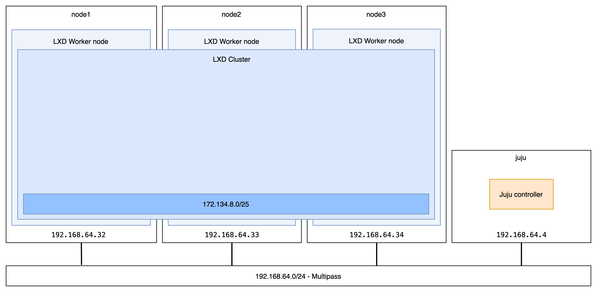
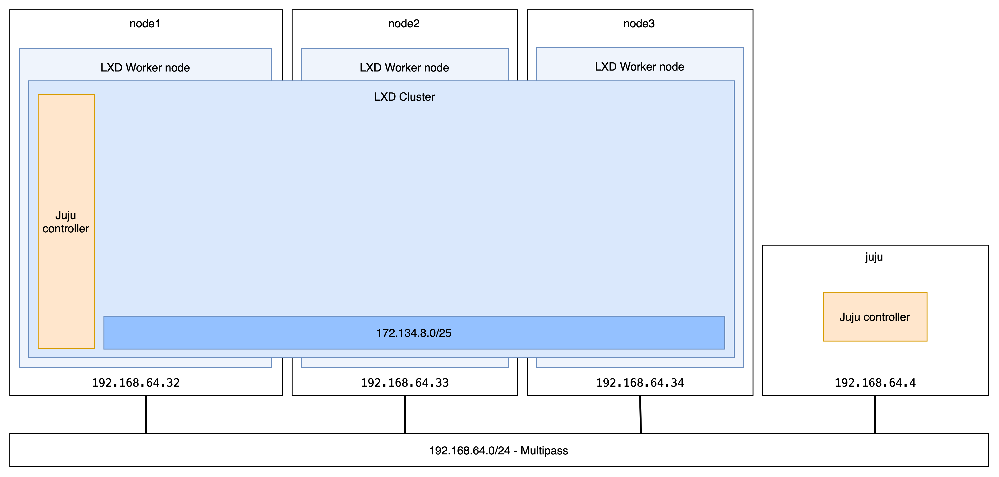

[< back to Step 2: Register for Model-Driven Operations](./step-02-model-driven-operations.md#2-register-for-model-driven-operations)

# #3 Cluster the machines with LXD: your first cloud

_Expected duration: 15mn_

This section is where we get to build our first cloud capabilities. We will cluster the physical (or, for our demo, virtual) machines together, abstracting them as a virtual layer capable of providing both Linux containers and virtual machines.
We will then have virtual machines from almost any Linux distribution available no more than one command away. (If you're a more advanced user, [read more on how to get Windows VMs with LXD](https://github.com/lxc/distrobuilder#repack-windows-iso).)

Abstracting away from the bare metal layer is a practical step to building automated, scalable, and modular micro clouds. You may wonder why we don't just go directly with the K8s layer (and you could do it), so here's what you get with the additional LXD virtualisation layer:

- **Increased security**: Machine containers provide better protection than K8s containers to keep your workloads confined.
- **Multi-tenancy**: In some situations, you might need more than one K8s cluster on the same micro cloud - don't shut any door now.
- **Flexibility**: Adding and removing physical nodes has never been easier. With LXD, you can [move containers/virtual machines](https://linuxcontainers.org/lxc/manpages/man1/lxc-copy.1.html) between physical nodes.
- **High-availability**: LXD adds a layer of resiliency to failures and outages with built-in high availability from 3 nodes and above.
- **Simplified operations**: The more you can abstract, the more you will standardise and automate remote management operations.

## Option A: Build your private LXD cloud in one Juju command

Thanks to Model Driven Operations, deploying and operating software is automated and repeatable; two key qualities for edge deployments.
Here's how to use the [LXD Charmed Operator](https://github.com/canonical/charm-lxd) to deploy and configure your micro cloud LXD cluster in one command.

### Deploy the LXD Charm

One command to deploy and configure your LXD cluster with Juju and the [LXD machine charm](https://charmhub.io/lxd):
```sh
ubuntu@juju:~$ juju deploy lxd -n3 --to 0,1,2 --config mode=cluster
# deploy -n: 3 units of the LXD application,
# --to: the micro cloud machines O,1,2 that we manually added,
# --config mode=cluster: tell the Charm to cluster the nodes
```

Grab a cocktail 🍹 while you watch Juju deploy and configure everything for you:
```sh
# Wait for the App and Workload statuses to be 'active'
ubuntu@juju:~$ watch --color juju status --color
Model    Controller    Cloud/Region  Version  SLA 
default  bare-default  bare/default  2.9.14   unsupported

App  Version  Status  Scale  Charm  Store  Channel  Rev  OS      Message
lxd           active      3  lxd    local             0  ubuntu  

Unit    Workload  Agent  Machine  Public address  Ports  Message
lxd/0*  active    idle   0        192.168.64.33          
lxd/1   active    idle   1        192.168.64.34          
lxd/2   active    idle   2        192.168.64.32          

Machine  State    DNS            Inst id               Series  AZ  Message
0        started  192.168.64.33  manual:192.168.64.33  focal       Manually provisioned machine
1        started  192.168.64.34  manual:192.168.64.34  focal       Manually provisioned machine
2        started  192.168.64.32  manual:192.168.64.32  focal       Manually provisioned machine
```

## Option B: Manually configure LXD cluster

If you want to see what is happening under the hood, you can manually configure LXD on each node and cluster them together. We recommend using the Juju option to save you some time and uncover the power of Charmed Operators, but you're also good to go with this option.

[Click here for instructions on manually building your edge cloud using LXD.](./step03-lxd-cloud/README.md#initiate-the-first-node)

---

> **Checkpoint #3: LXD cluster ready to operate.**

```sh
ubuntu@node1:~$ lxc cluster list
+-------+----------------------------+----------+--------+-------------------+
| NAME  |            URL             | DATABASE | STATE  |      MESSAGE      |
+-------+----------------------------+----------+--------+-------------------+
| node1 | https://192.168.64.32:8443 | YES      | ONLINE | Fully operational |
+-------+----------------------------+----------+--------+-------------------+
| node2 | https://192.168.64.33:8443 | YES      | ONLINE | Fully operational |
+-------+----------------------------+----------+--------+-------------------+
| node3 | https://192.168.64.34:8443 | YES      | ONLINE | Fully operational |
+-------+----------------------------+----------+--------+-------------------+
```


<!--  -->

---

[Next step (4/5): Create on-demand MicroK8s clusters >](./step-04-microk8s-cluster.md#4-create-on-demand-microk8s-clusters)
