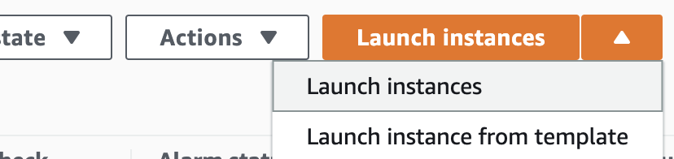
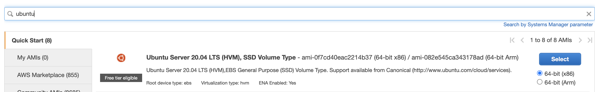
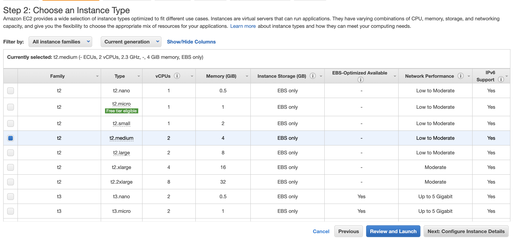
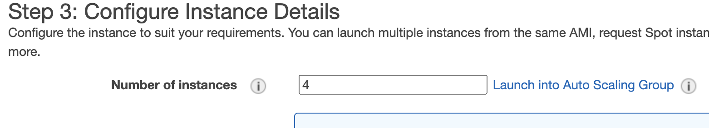
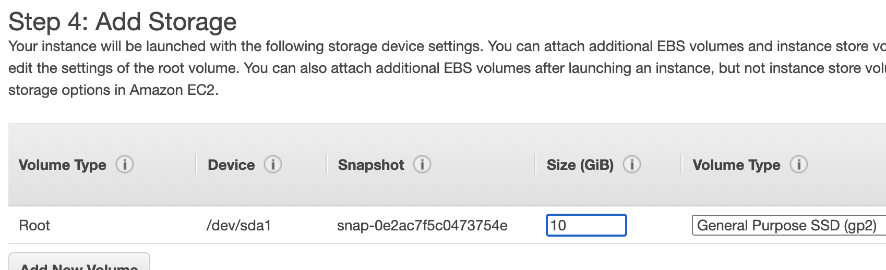
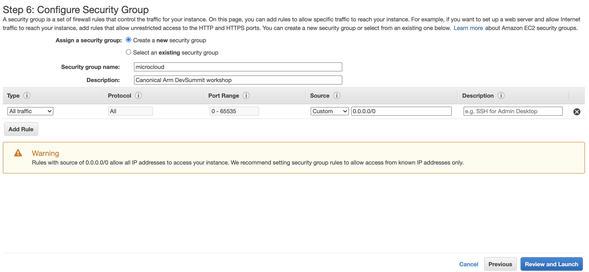
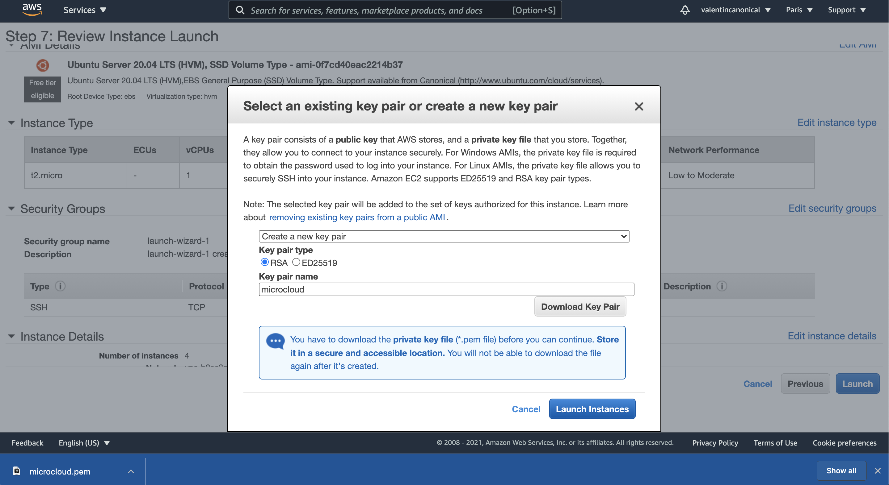
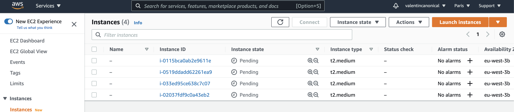
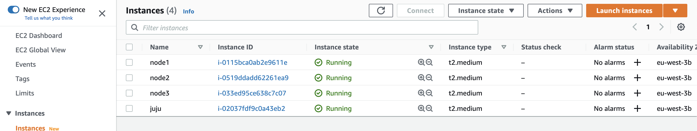
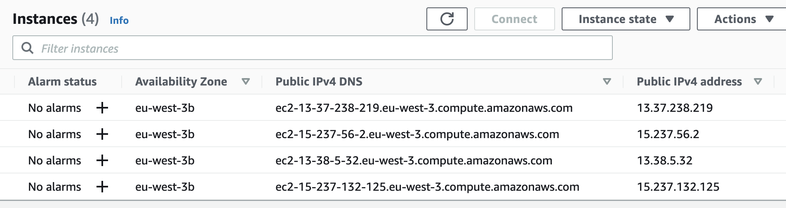

[< back to Step 1: Prepare the bare metal nodes](../step-01-prepare-bare-nodes.md#1-prepare-the-bare-metal-nodes)

# Using EC2 instances on AWS

You need an AWS account with access to the EC2 service and billing permissions.

Access the EC2 console for your region of choice at https://us-west-2.console.aws.amazon.com/ec2/v2/home#Instances.

In the next steps we will:
1. Launch the virtual instances
2. Configure them
3. Configure your host to make the tutorial's instructions easier to follow along

## 1 - Launch the virtual nodes

Locate the "Launch instances" button and click on it.



### Pick the latest Ubuntu LTS Cloud Machine Image

Search for "Ubuntu" and pick the latest LTS (20.04) version available.



<!-- TODO test tutorial on ARM64 and compile stuff -->

#### Choose the instances type

The free-tier won't be enough for the micro cloud nodes, select an instance type with at least:

- 4GB RAM
- 2 vCPUs



Click "Next: configure..." to configure the instances details.

#### Configure the instances

Make sure to change the "Number of instances" to 4 in the same "Network".



Click "Next: add storage."

#### Configure storage

The default - 8GB - will be a little low to go through the tutorial. We recommend 10GB. Make the change here.



Click "Next: add tags" and "Next: configure security group".

#### Configure network access (Security group)

Create a new security group, and **make sure to change the default rule to "All traffic" from any IP address**.



### Launch the instances

Click "Review and Launch" and "Launch".


When asked, opt to create a new SSH key that you'll download to your computer.



Launch the instances and head back to the console.



## 2 - Configure the instances

### Rename the machines

To make our life easier, we will rename all the machines arbitrary in "node1", "node2", "node3", and "juju".



### Locate the IP addresses




### Configure SSH hosts

On **your host**, edit your SSH configuration (`~/.ssh/config`) as below to avoid using the IP/DNS addresses.

```sh
# Locate the 'microcloud.pem' SSH key provided to you by EC2:
$ mv /path/to/microcloud.pem ~/.ssh/microcloud.pem

# Restrict permissions to enable its use as SSH key
$ chmod 600 ~/.ssh/microcloud.pem

# Edit the .ssh/config file to make further steps easier
$ cat ~/.ssh/config

Host *.aws
    User ubuntu
    IdentityFile ~/.ssh/microcloud.pem
    IdentitiesOnly yes

Host juju.aws
    HostName ec2-juju-ip.eu-west-3.compute.amazonaws.com

Host node1.aws
    HostName ec2-node-1-ip.eu-west-3.compute.amazonaws.com

Host node2.aws
    HostName ec2-node-2-ip.eu-west-3.compute.amazonaws.com

Host node3.aws
    HostName ec2-node-3-ip.eu-west-3.compute.amazonaws.com
```

### Alias hostnames

To avoid further confusions, let's set an explicit hostname for each machine (for the first time, accept the SSH fingerprint):

```sh
ssh juju.aws -- sudo hostnamectl set-hostname juju
ssh node1.aws -- sudo hostnamectl set-hostname node1
ssh node2.aws -- sudo hostnamectl set-hostname node2
ssh node3.aws -- sudo hostnamectl set-hostname node3
```

You can try it worked as expected, logging into one of the nodes:

```sh
$ ssh node1.aws
ubuntu@node1:~$ # done!
```


## 3 - Following along 

Once you've completed the instructions above, following the tutorial should be easy.    
For the next steps of the tutorial, pay attention to the instructions and make sure to replace as following where needed:
```sh
# multipass shell node1
ssh node1.aws

# multipass exec node1 -- command
ssh node1.aws -- command

# juju add-machine ssh:ubuntu@<ip-node1>
juju add-machine ssh:ubuntu@ec2-node1-ip.region.compute.amazonaws.com
```


---

> **Checkpoint #1: Four Ubuntu EC2 instances on the same network (VPC) with access to each other.**

---

[Next step (2/5): Register for Model-Driven Operations >](../step-02-model-driven-operations.md#2-register-for-model-driven-operations)